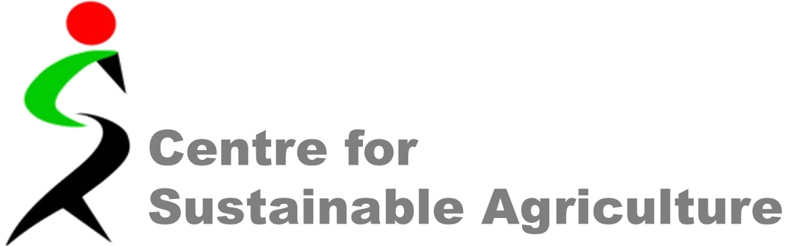
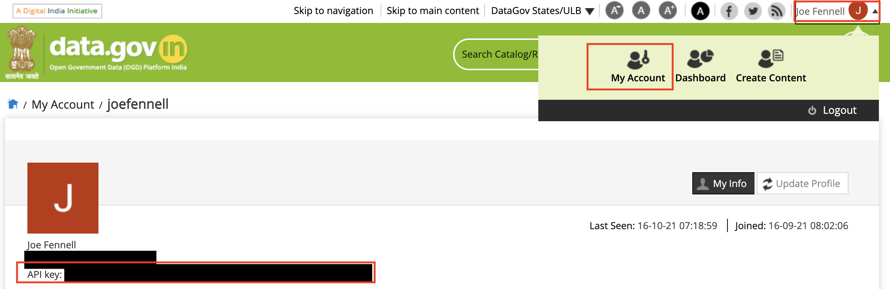
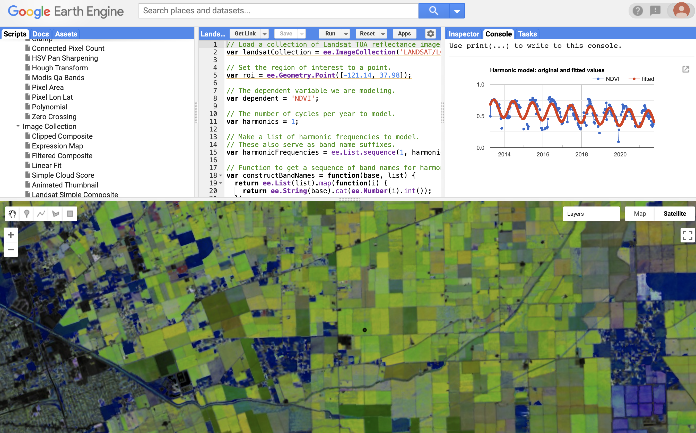

# STFC FN+ COP26 Hackathon
<table>
<tr>
<th></th>
<th></th>
<th></th>
<th></th>
</tr>
</table>

## Event Handbook
This handbook contains all the necessary information for participants of the event. If you have any queries about the materials provided or find a problem, please email [helpdesk@joefennell.org](mailto:helpdesk@joefennell.org)

## 1. The Challenge
Through our partnerships with UKRI STFC, STFC Hartree Centre, IBM Research, and the [Centre for Sustainable Agriculture](https://csa-india.org/) we have identified a need to provide smallholder farmers with timely and location-specific advice about the crop types and varieties they should grow. Our challenge for the hackathon is to bring together hugely varied datasets - from market price data to soil maps - to design an integrated **open access** platform for recommending crop type, planting date and management advice for smallholder farmers in India.

## 2. Pre-event activities
### 2.1. Register with Open Government Data Platform India

This data service is part of the Indian Open Government Data initiative and provides a large number of datasets across multiple sectors. It is important to register for an account as you will need an API Key to access the database.

[**Click Here To Register**](https://auth.mygov.in/user/register?destination=oauth2/register/datagovindia)

### 2.2. Check you can access your API key

### 2.3. Get a Google Account and register for Google Earth Engine
Google Earth Engine allows you to access and process different geospatial datasets.
In particular there is now access to Sentinel 2-Level 2A multispectral imagery

[**Click Here To Register**](https://earthengine.google.com/)

## 3. Participation and Agenda
First up, please read the [code of conduct](CODE_OF_CONDUCT.md). By participating in this event, you agree to adhere to the terms of this agreement.

Secondly, please make a note of the times of the two mandatory sessions: 10:00 - 11:00 GMT on Tuesday 2nd November and 14:15 - 16:15 GMT on Friday 5th November.

| **Tuesday 2nd November**| | |
|:--- |:--- |:--- |
10:00-10:30 GMT | Welcome and Introduction | Professor Sonal Choudhury
10:30-11:00 GMT | Q&A: Technical/Practical Advice | Dr Joe Fennell
**Friday 5th November**
14:00 GMT | Deadline for slide submission | send to helpdesk@joefennell.org
14:15-15:30 GMT | Team pitch |
15:30-16:00 GMT | Judging (offline) |
16:00 - 16:15 GMT| Award

## 4. Your pitch
Your team needs to produce a 10 minute pitch that showcases your idea. The format is up to you, but remember this is a pitch for funding, so you need to present a coherent argument for why your app should be funded.

It could include :
- [**User Stories**](https://www.atlassian.com/agile/project-management/user-stories) Descriptions of why and how your users will interact with the platform
- **Results**  from the data experiments you carry out during the hackathon
- **How the app will work** This could include a description of analysis strategies
- **Visualisations** This could be example interfaces shown as mock-ups, wireframes or prototype demonstrations
- **Management** How your team will use the investment to produce the platform. How will you keep it running?

You must submit your slides by 14:00 GMT on Friday 5th of November (email slides or a link to helpdesk@joefennell.org). Slides
submitted later than this will not be accepted, but you will still be able to
pitch (without slides).

Alternatively, you are welcome to submit a video presentation of no more than 10
minutes by the slide deadline. This should be hosted on Youtube or Vimeo and cannot be edited after the deadline. Please email the link as above.

## 5. Recommended Datasets
We have included data gathered by project partners as well as relevant 3rd party geospatial data providers.

### 5.1. Farm survey data
This is a 4 year farm survey with the yield and crop type along with incomplete spatial information. The dataset is included in this repository: [data/2016_to_2020_ICS_data_v3_-_MP.xlsx](data/2016_to_2020_ICS_data_v3_-_MP.xlsx)

| Field | Description | dtype |
| --- | --- | --- |
Year | Year of survey | int
Farmer Tracenet code | unique farmer code | str
Village | Village of farm | str
District | District of farm | str
State | State of farm | str
Latitude | Latitude of farm. Although may not be exact | float
Longitude | Longitude of farm (May not be exact) | float
Crops | Crop type | str
Area (HA) | Area of that crop type | float
Estimated yield | Weight of crop in metric tonnes | float

### 5.2. Market data from Indian Government
The [data.gov.in](https://data.gov.in) website has over 300,000 datasets. Part of this hackathon is about exploring the breadth and quality of these data. The most relevant section is probably the [agricultural markets section](https://data.gov.in/sector/agricultural-marketing).

An example dataset is the Daily Market Prices of Garlic across India. The holding
page is here:
[https://data.gov.in/resources/variety-wise-daily-market-prices-garlic-2021/api](https://data.gov.in/resources/variety-wise-daily-market-prices-garlic-2021/api) displaying the resource ID.

You can then make an API request over https to download a CSV. e.g.

https://api.data.gov.in/resource/af4ed290-ed4f-40e1-a8b8-a4440e57a9ed?api-key=579b464db66ec23bdd000001cdd3946e44ce4aad7209ff7b23ac571b&format=csv&offset=0

> Note that the `api-key` has been set to a test key that limits the number of
records to 10. You can replace this with the key in your user space (see section 2.2).

There is a pip-installable package called `datagovindia` that offers a Python interface
to the data service: [visit project pages](https://pypi.org/project/datagovindia/).
We have not tested this. Another option would be using the [Requests](https://pypi.org/project/requests/) library in Python to help you parse requests to the web service.

### 5.3. Soil Data
Your project may require soils data. One source is [Soil Grids](https://data.isric.org/geonetwork/srv/eng/catalog.search#/home) who provide a [Web Mapping Service](https://maps.isric.org/) for various soil parameters. This is gridded at different spatial resolutions, but typically 250m.

You can access this in many different ways. One option would be the [OWSLib](https://geopython.github.io/OWSLib/introduction.html) Python interface.

### 5.4. Google Earth Engine
Earth Engine is a tool giving access to many freely-available Remote Sensing datasets and allowing on-the-fly processing for various analyses. It can be accessed via the Code Editor GUI

**Google Earth Engine Code Editor**

Alternatively it can be accessed via the Python API. An introduction to this can be found here [here](https://developers.google.com/earth-engine/guides/python_install-colab)

### 5.5. Fertiliser and Pesticides Data

### 5.6 Other Information Sources

| Link | Type |
|:--- | :--- |
[Seednet](https://seednet.gov.in) | Crop groups and crops based on seednet
[Crop Nutrition](https://www.cropnutrition.com/efu-soil-ph) | Soil pH information
[Natural Resource Conservation Service](https://www.nrcs.usda.gov/Internet/FSE_DOCUMENTS/nrcs142p2_053260.pdf) | Soil bulk density Information
[FAO](http://www.fao.org/tempref/FI/CDrom/FAO_Training/FAO_Training/General/x6706e/x6706e06.htm) | Soil Classifications
[AgroMonitoring](https://agromonitoring.com/api) | Alternative service for remotely-sensed imagery and weather data (polygon API)
[Weather Stack](https://weatherstack.com/product) | weather data
[AccuWeather](http://apidev.accuweather.com/developers/) | weather data
[Indian Weather Service](http://nwp.imd.gov.in/dist_fcst.htm) | weather forecast data
[Krishi](https://krishi.icar.gov.in/ObservationData/) | Agricultural study/monitoring data
[Moqups](https://moqups.com/) | Wireframe and prototyping tools
